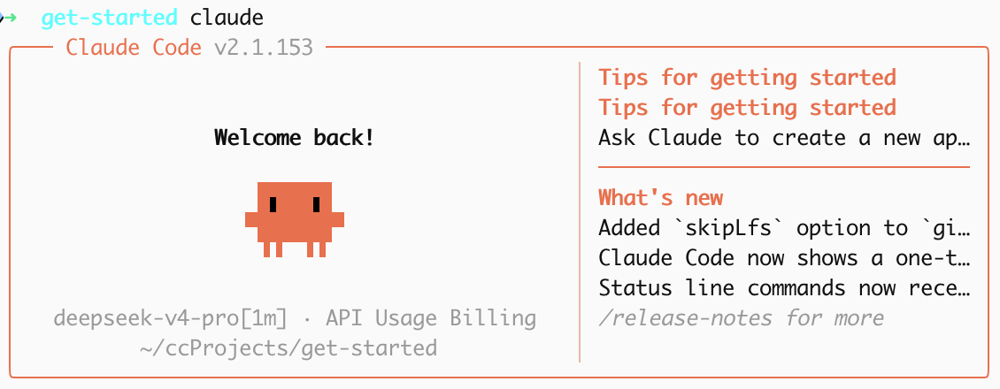

# Claude Code 环境配置 StepByStep

> 参考：https://api-docs.deepseek.com/zh-cn/quick_start/agent_integrations/claude_code

## 准备
1. 安装 Cli
```
npm install -g @anthropic-ai/claude-code
```
2. 确认配置成功：`claude --version`
- 2.1.153 (Claude Code)
3. 配置模型（这里选的是 DeepSeek V4）
```
export ANTHROPIC_BASE_URL=https://api.deepseek.com/anthropic
export ANTHROPIC_AUTH_TOKEN=<你的 DeepSeek API Key>
export ANTHROPIC_MODEL=deepseek-v4-pro[1m]
export ANTHROPIC_DEFAULT_OPUS_MODEL=deepseek-v4-pro[1m]
export ANTHROPIC_DEFAULT_SONNET_MODEL=deepseek-v4-pro[1m]
export ANTHROPIC_DEFAULT_HAIKU_MODEL=deepseek-v4-flash
export CLAUDE_CODE_SUBAGENT_MODEL=deepseek-v4-flash
export CLAUDE_CODE_EFFORT_LEVEL=max
```

  - （可选）将配置存储到环境变量中，防止每次都需要生成一次 API Key，重复配置
  - `vim .dsfile`，将 3 中的信息填入，输入 `:wq` 保存
  - 将 `.dsfile` 加入自动执行脚本中，`.zshrc` 或 `.bashrc`（这里使用 .zshrc）
  - 添加指令
```shell
# enable cc DeepSeek proxy
if [ -f ~/.dsfile ]; then
    source ~/.dsfile
fi
```

## Claude 环境确认
- 创建一个新文件夹：`mkdir get-started`
- 进入：`cd get-started`
- 运行 `claude`，进行基础的确认，就配置成功了

- 也可以运行 `/status` 指令，看更详细的信息
```
Version:             2.1.153
Session name:        /rename to add a name
Session ID:          5b067695-6bab-4eb6-a89e-f2b32aa8addc
cwd:                 /Users/jiangxiaokun/ccProjects/get-started
Auth token:          ANTHROPIC_AUTH_TOKEN
Anthropic base URL:  https://api.deepseek.com/anthropic

Model:               deepseek-v4-pro[1m]
Setting sources:     User settings
```

  - 新开一个 terminal 窗口，运行 claude，也可以看到模型为 DeepSeek，配置完成🎉