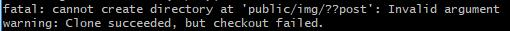

# 由git clone之后 all files modified 引发的思考

## 缘起
原项目在Mac上开发，在 Windows 电脑执行 git clone 时，全部文件状态变为 modified.
> **!!!** 如果只想看文件Git status异常的问题的结果，请点击 [剧情反转](#reverse)

### 初始情况
- 源文件换行符为 LF
- windows 上的配置按照惯例已经将 自动转换关闭，即 autocrlf 为 false

### 遍寻资料之后找到可能的解决方案
1. git config --global core.autocrlf true
2. git config --global core.autocrlf input
3. git config core.filemode false
4. git config core.safecrlf true/false/warn
4. 添加 `.gitattributes` 配置文件

### 分析可行性，并扫除知识盲区
1. `git config --global core.autocrlf true`
> 工作原理是windows上，在执行 git clone的时候，会把文件的格式都转为 CRLF, 在提交的时候 再转回 LF. 在最开始学习 Git 的时候我们就知道，这种自动转换很容易因为`编辑器创建文件或者引入文件`出现CRLF和LF文件共存的问题，这里即使解决了，也不是我们想要的方案。

- 新增一个 CRLF 文件，或者原来为LF已经被转成CRLF的文件，在进行push之后，最终的文件确实转回了 LF，至少证明这个配置不是一无是处

**需要注意的是：**

> git config settings can be overridden by `.gitattributes` settings.

> 项目中已经存在的LF文件，变成了历史遗留问题，只有当其发生变化再 add 的时候才有可能发现，而 Git 并不会帮你转换，只是 报个错给你看`fatal: LF would be replaced by CRLF in demo/t.html`就没有然后了，典型的耍流氓

> 如果你在 windows上创建了一个 LF 文件的格式，在要 git add 的时候也会报错 `fatal: LF would be replaced by CRLF in demo/t.html`，蠢哭了，啥也不能干，只会报错


- 个人理解就是：项目最开始不能有遗留问题(实践发现不可能避免，且 git clone 时总有个别奇怪的文件CNAME和README.md没有被转成CRLF)；多人开发时，需保证每个人的配置都应该是 core.autocrlf true (或者项目配有后面将提到的 `.gitattributes`)

2. `git config --global core.autocrlf input`
> 按照说明：`会在Windows系统上的签出文件中保留CRLF，会在Mac和Linux系统上，包括仓库中保留LF`, 根本听不懂有木有？ 那就实际操作一波！创建一个CRLF 文件，分别执行 git add 和 git commit，文件纹丝不动，擦泪，什么情况？ 再琢磨一下上面的说明，吓出一身冷汗，windows上和Mac上两套换行符(不就是两套代码吗，太可怕了！)。但是既然有这个配置，肯定是有用的，拜读了大佬的解释之后才算理解了三分，大佬的解释:

> How `autocrlf` works:
> ```
> core.autocrlf=true:      core.autocrlf=input:     core.autocrlf=false:
>
>         repo                     repo                     repo
>       ^      V                 ^      V                 ^      V
>      /        \               /        \               /        \
> crlf->lf    lf->crl      crlf->lf       \             /          \
>    /            \           /            \           /            \
> ```

#### 并给出了建议
> ***`never use core.autocrlf = input unless you have a good reason to (eg if you're using unix utilities under windows or if you run into makefiles issues)`***

> 简单来说就是，不懂怎么用就别瞎用，当这个配置不存在就好了

3. `core.safecrlf XXX`
    - 这货也是一个 `validate`，只是做校验用的，不会帮你做转换
    - `core.safecrlf true`: 拒绝提交包含混合换行符的文件
    - `core.safecrlf false`: 允许提交包含混合换行符的文件
    - `core.safecrlf warn`: 提交包含混合换行符的文件时给出警告

4. `core.filemode false`: 参考 [Git文档](https://mirrors.edge.kernel.org/pub/software/scm/git/docs/git-config.html)， The default is true.
> 因为NTFS没有Linux下丰富的权限，所以Git clone 下来的文件的权限很可能会发生变化，从而导致所有文件发生改变

- 虽然有文章表示：只有可执行文件才会受影响，但是本着死马当活马医的态度，还是将其置为false，表示忽略权限变更引起的文件变更，依然没有解决。

5. `.gitattributes`
阅读gitattributes的用法之后发现主要四个配置：
- text 控制行尾的规范性
- eol 设置行末字符
- diff 设置Git对特殊文件生成差异的方式。 eg. .doc 文件发生更改时，执行 git diff.
> 常规使用可以看 [Git的gitattributes简介](https://www.jianshu.com/p/bcdb8fff1687)，或者文末的官方文档。配置.gitattributes 依然是解决换行符相关的问题。只是多了更针对性的配置，但本质没变，经过尝试之后依然 all files modified，`只能暂时搁置`

#### 个人理解的Git最佳实践
1. 配置 core.autocrlf false, 在 .gitattributes 或 命令行全局配置
2. 编辑器默认创建的文件 设置为 LF
> 即使不小心混入了个别CRLF文件，不会影响其他的文件，且很容易被控制在一个小范围并被找到和改回来

### 研究过程中的小小收获
1. 配置 VScode，默认创建出来的文件即是LF,一劳永逸
> 点击顶部菜单：文件>设置>首选项，搜索框输入: `files:eol`, 将默认行尾字符改为 \n (LF)
2. 使用 vim 打开文件：vim README.md
`README.md [unix] (01:34 14/11/2018)`
> 查看换行符为 unix 风格的，即为 LF
3. 使用 vim 打开文件之后，输入 `:set list` 进入 listmode, 可以看到以“$”表示的换行符和以“^I”表示的制表符

## 剧情反转 {#reverse}
- 由于最开始的目的不是为了快速解决问题，而是探寻问题的本质，所以竟然趁着这个机会把Git又学习了一遍。但是再对Git了解更深后依然没有头绪。直到今天用公司的 windows 电脑再clone下来之后，在同事的提醒下发现了


- 出现 all files modified 的原因**原来是**：`Clone succeeded, but checkout failed`
- 而出现 `checkout failed` 的原因是一个乱码的文件夹，这个乱码文件夹是在Markdown引入图片资源的时候，jekyll创建的，找到了出问题的原因，解决起来就方便多了，只需要把乱码的文件夹改掉就好了
- 由于文件 checkout failed，不敢直接改了上线，怕将错误的文件上传，覆盖了原本正常的文件，最后选择了直接GitHub上修改文件的方式。至此，**总算是将这个困扰许久的问题初步解决了**。
- 那为什么会出现这个乱码的文件夹呢，难道是 jekyll 的锅？还有md文件也存在乱码，这两个问题很可能是同一个问题，乱码的解决过程，请看 [隐藏字符引发的血案](/css/2018/11/15/ghost_chars/)

## 反思
> 传说软件开发有三个层次：看山是山(即能看到问题，也知道问题，却也只停留在问题层面)，看山不是山(能看到问题，也能看到问题的前因后果，开发语言也好技巧也罢，都是为了需求而生，你看到的是一堆纷繁的技术，他看到的是一堆实现目标的工具)，看山还是山(每一门技术有他的适用面也有它的局限性，没有最好只有最适合，JS还是那个JS，只是少年不再是那个少年)

- 也许是对技术过于敬畏，当很多触碰到底层，触碰到源码的时候，就会产生一种惧怕感，迫切希望外界能提供协助，比如`Google`或者`Stack Overflow`，业务需求是一方面，最关键还是变懒了，很多问题浅尝辄止，总是拿产品需求紧来当挡箭牌

- 其实静下心来，仔细看看报错信息，兴许问题就已经解决大半了，（这次的问题就是忽略了**日志**这一关键信息）；多打印点日志，很快就能定位到问题的区域；定位问题之后确认是库或者框架的问题，专门查看相关API文档兴许就已经解决了（好的API文档比Google更精确）

- 阅读特定部分的源码实现：（最优的是直接发现合理的方案，次优的是找到替代方案，再次的是至少知道了为什么会出问题，下次能够避免，最次的是给框架做了测试，可以提Issue或者PR帮助框架的改进）


## 意外收获
[antony-hatchkins大神关于 core.autocrlf 的详解](https://stackoverflow.com/questions/1967370/git-replacing-lf-with-crlf)

[一堆有用的.gitattributes](https://github.com/alexkaratarakis/gitattributes)

[如何删除已经push到远端repo仓库的文件](https://www.zhihu.com/question/20418177)
- 最优的方案应该是:

```
git rm -r --cached .idea  #--cached不会把本地的.idea删除
git commit -m 'delete .idea dir'
git push -u origin master
```
- 由于 git clone下来的所有文件都是 modified，且存在乱码( **下一篇博客会讲解如何解决乱码问题**)，所以不敢在 windows电脑上处理好之后再push，最终选择的是网页github 操作，即 **零点小筑** 的回答

## 参考
[避免NTFS文件权限变更引起的修改](https://www.jianshu.com/p/3b0a9904daca)

[Git的gitattributes简介](https://www.jianshu.com/p/bcdb8fff1687)

[gitattributes官方文档](https://git-scm.com/docs/gitattributes)