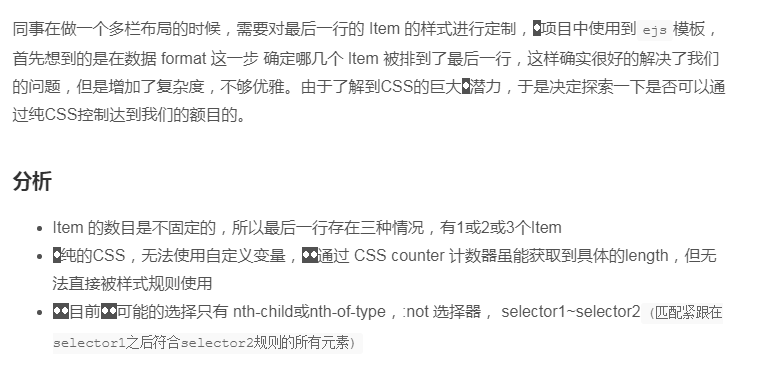
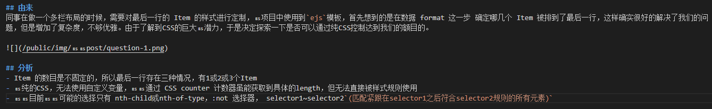

# 隐藏字符引发的血案

## 前因
使用 `GitHub` 和 `jekyll` 搭建博客，公司的电脑是Mac，家里的电脑是windows，前面遇到了 git clone 下来文件所有文件都提示已更改的问题，对文件字符出现乱码的本质原因没有仔细探究。作为一个留了坑，心里会记很久的人，最有效的方法当然是探寻问题的本质，找到根本解决之法咯（没办法，我也是被迫的）

### 问题表现
1. 因为文件名乱码导致 git clone 失败，git check failed，所有文件被标识为modified状态
2. 文章在 windows 电脑上展示效果，不忍直视

## 尝试解决
1. 首先怀疑是编码的问题，一个GBK, 一个utf-8的老问题，不能忽视，查看最终生成的HTML文件，meta 没有问题
2. 打开浏览器控制台，瞄一眼Elements没什么问题呀(不够仔细，与问题擦肩而过)，再看 font-family 和 woff2 字体文件的下载，也没发现什么问题
> 既然出问题了，肯定有原因的，回来查看windows的源markdown文件 发现也乱码了, 所以暂时能排除是 jekyll 转换 HTML 出的问题。难道是Git的锅？在windows上 Git clone下来之后除了能改换行符，还能改其他字符？这太不科学了，得换个思路。

## 从更小的粒度分析
1. 既然产生乱码了，看看到底是哪些个字符乱码了，如果实在没法定位哪个字符，至少知道是哪一段字符出现了问题
> 结果发现：Mac 中正常的字符，在即使乱码中的文件和windows网页上，都能展示正常，这里证明是多了一些乱码字符，而不是字符转码或者解析出问题了

2. 那多出来的字符是什么呢？我们再回到控制台，这次不再粗略地看一眼Document，而是找到错误的区域，点击 `Edit as Html`，可以看到原来乱码的地方出现了类似 **·** 这样的字符，这样的字符在 Mac 的电脑上被浏览器忽略了，而在 windows 上却被渲染出来了，从而出现了我们看到的乱码。那这多余的字符到底是如何产生的呢，输入法，VSCode，Markdown还是其他？

## 查资料
- Google `Mac 隐藏字符`，原来是 VScode 的锅(底层是`chromium`的锅)，在开启 Markdown 实时预览模式的时候，退格键删除输入的文字，竟然会留下一个`退格符`，真的是神坑

- 开启VScode显示隐藏字符的设置：`"editor.renderControlCharacters": true`

    可以看到确实出现了小小的类似`bs`这样的特殊字符，罪魁祸首找到了！

- 那如何避免呢？遗憾的是这是内核底层的BUG，所以没有完美的解决方案

- **暂时规避的办法**：写md不开preview预览；开启显示隐藏字符的设置，出现back space等特殊字符时手动删除。

## 参考

[Mac 上的 VSCode 编写 Markdown 总是出现隐藏字符？](https://www.zhihu.com/question/61638859)
