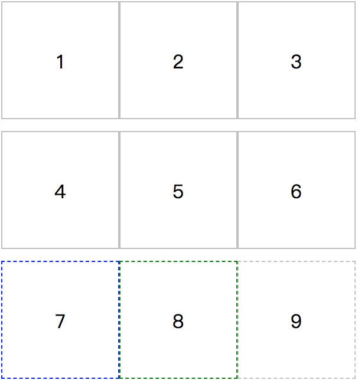

# 由一个特殊布局引发的思考
## 由来
同事在做一个多栏布局的时候，需要对最后一行的 Item 的样式进行定制，项目中使用到`ejs`模板，首先想到的是在数据 format 这一步 确定哪几个 Item 被排到了最后一行，这样确实很好的解决了我们的问题，但是增加了复杂度，不够优雅。由于了解到CSS的巨大潜力，于是决定探索一下是否可以通过纯CSS控制达到我们的额目的。



## 分析
- Item 的数目是不固定的，所以最后一行存在三种情况，有1或2或3个Item
- 纯的CSS，无法使用自定义变量，通过 CSS counter 计数器虽能获取到具体的length，但无法直接被样式规则使用
- 目前可能的选择只有 nth-child或nth-of-type，:not 选择器， selector1~selector2`(匹配紧跟在selector1之后符合selector2规则的所有元素)`

## 基础知识
- 伪类选择器中的 n 是从 0 开始递增的
- 负索引值不会匹配元素，故 2n-1 和 2n+1 实际的匹配效果是一致的
- CSS 样式解析顺序为从右往左，复合选择器则无先后之分，无主次之分
> 举例1：.class1.class2 {} 中，.class1 和 .class2 地位相同且相互独立，只是最终生效的时候进行了取交集操作，并集选择器 .class1,.class2 {} 也是类似

> 举例2：.item:nth-child(3n+1):nth-last-child(-n+3) 这个交集选择器中 ，.item:nth-child(3n+1)的 n 和 后一个选择器中 的 n 相互独立，匹配结果为：`同时满足①item为第1、4、7……且②item处于列表中的最后3项 】`，**而不是**： 1.倒数第3项且是第1项，2.倒数第2项且是第4项，倒数第一项且是第7项

## 思考方法
### 一、先列举出所有的可能情况，找到规律。
题中实际出现的有以下几种情况：
- 余数为1，则length 为3n+1，只需要匹配最后一项即可
- 余数为2，则length 为3n+2，需匹配最后两项(或者最后一项和其后面的项)
- 余数为3，则length 为3n，需匹配最后三项(或者最后一项和其后面的项)

### 二、解决思路
1. 余数为1时匹配最后一项，余数为2时匹配最后两项，余数为3时匹配最后3项，匹配最后N项很容易，问题变成了：`确定余数是几`
2. 不关心具体有多少项，将 3n+1 3n+2 3n+3 都取出来，只要 匹配最后一个n即可，问题变成了：`如何保证3n+3 匹配到的Item的索引值大小排序是3n+1 < 3n+2 < 3n+3`
3. 取出 3n+1 规则匹配到的最后一条记录，这一个Item一定在最后一行，再将其后的元素取到，就OK了，问题变成了：`如何确定 3n+1 匹配的Item 是最后一个被匹配到的(此时n为能匹配到的最大值)`

### 三、确定方案
- 方案一：单纯的CSS 无法实现，借助 sass 或者 CSS4或许能实现
- 方案二：由于已有的匹配规则，3n和3n+3单独作用的时候表现完全一致，需要辅助规则才有可能实现
- 最终确定为方案三

### 代码实现
1. 取出最后一个3n+1项：【这里的 -n+3 选中的是是最后三项】

```.item:nth-child(3n+1):nth-last-child(-n+3)```

2. 取出最后一个3n+1项后面的项：

```.item:nth-child(3n+1):nth-last-child(-n+3)~.item```

3. 求并集：

```.item:nth-child(3n+1):nth-last-child(-n+3), .item:nth-child(3n+1):nth-last-child(-n+3)~.item {/* custom style.*/}```


### 延伸丶应用
- 匹配前X个元素： -n + X (eg：前三个元素， -n + 3)
- 多栏布局最后一行的样式需要定制，都可以使用以上方案
- ……
- 小思考：如何选中第一行的奇数项呢 `提示：先确定是几栏布局，然后通过-n+X 和 2n + 1`

## 兼容性
IE7+和现代浏览器：
> IE7 and IE8 support only these CSS3 selectors: General siblings (element1~element2) and Attribute selectors [attr^=val], [attr$=val], and [attr*=val]

## 总结
- CSS 有很大的可能性等待发掘，在我们编写页面布局的时候，展示相关的部分使用纯净的CSS实现，避免数据或者JS逻辑的混入，能够显著的提高代码的可读性和布局的健壮性，实现良好的解耦
- 实际项目中还需根据业务需求选取方案，本文中的方案仅提供一种思路

## 参考文章
[CSS:使用nth-child()选择最后一行](https://www.jianshu.com/p/db65ae0a3c2e)
