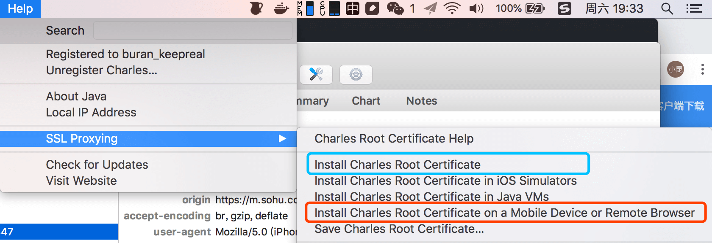
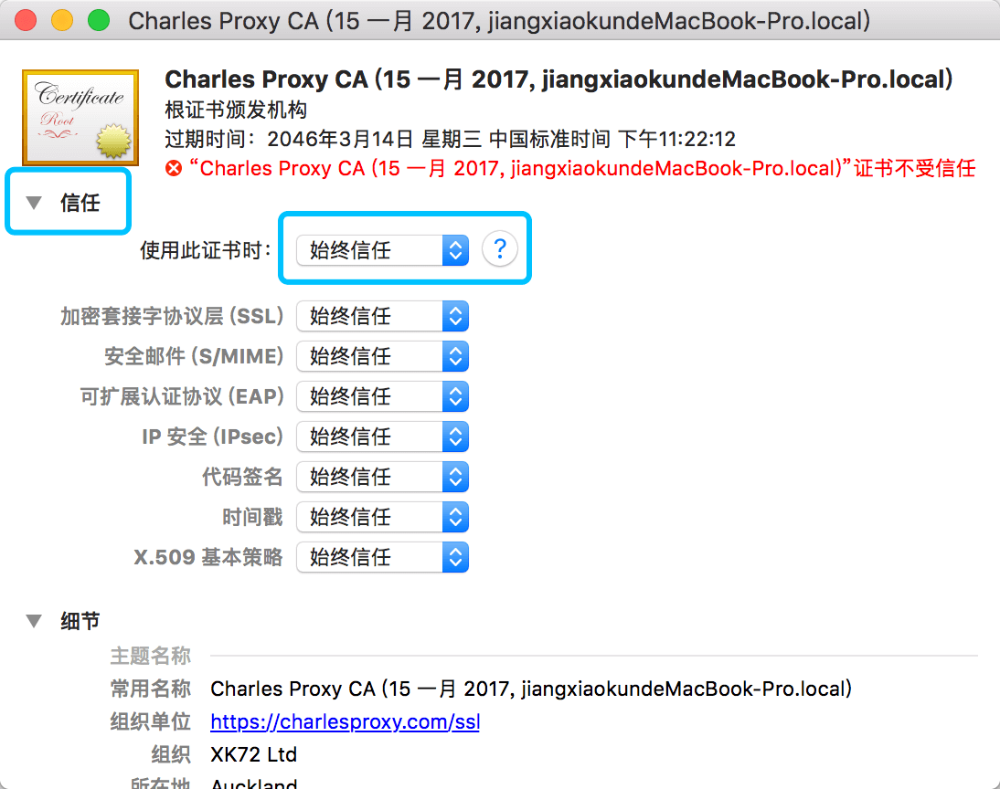
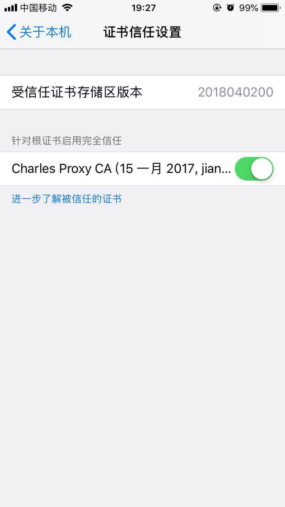
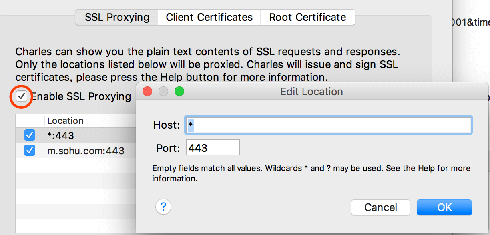
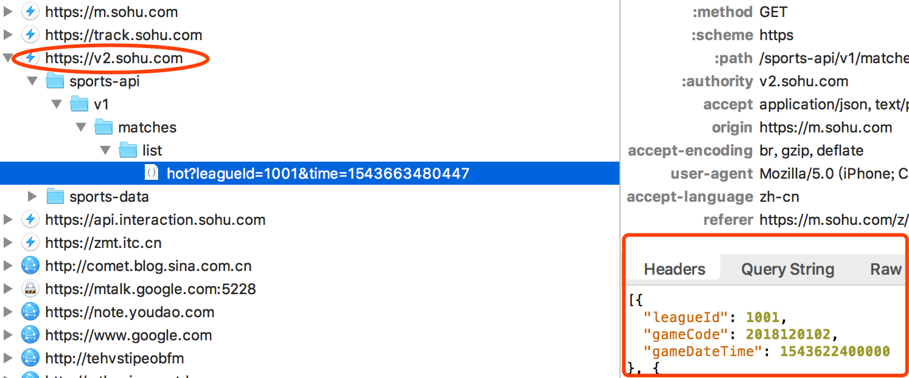

# Charles破解与HTTPS抓包
#### 基础环境
> MacOS：10.13.6       iPhone6s：11.4.1

### 准备工作
#### 下载 Charles
- 官网：https://www.charlesproxy.com/download/
> 百度云：https://pan.baidu.com/s/1sTAbB_AZ_WkIgRsqdnoIOA  密码:xcoz

#### 破解 jar 文件
在线生成jar：https://www.zzzmode.com/mytools/charles/
> 百度云：https://pan.baidu.com/s/1w4bugeIW2HKIsspvQpu8OQ  密码:zmql

### Charles破解
1. 下载Charles并安装
2. 下载破解的`charles.jar`，替换掉安装目录下的 `charles.jar`
    > macOS: /Applications/Charles.app/Contents/Java/charles.jar

    > Windows: YOUR_DIR\Charles\lib\charles.jar

## Charles支持手机HTTPS
#### 在Mac上安装 Charles 根证书
1.点击最上面的菜单栏的`Help`,选择`SSL proxying`, 再选择`Install Charles Root Cerificate`

2. 弹出`添加证书`对话框，点击`添加`，输入密码之后，点击`修改钥匙串`确认
3. 这时候添加的证书默认是`不受信任的`，找到`Charles Proxy CA`开头的证书，右键`显示简介`，点开`信任`，在展开菜单中的`使用此证书时`，选择`始终信任`，点击左上角的关闭，弹出对话框后输入密码`更新设置`即可。

#### 在手机上安装证书
1. 让手机代理连上电脑的Charles（跟普通手机连代理的步骤一样）
> 打开无限局域网，选中同一个WiFi，点击`配置代理`，选择`手动`,在弹出的表单页面中，服务器填写`电脑IP`，端口填写`8888`（Charles默认端口是8888）
2. 打开`Safari`，在浏览器中输入`chls.pro/ssl`（或`http://charlesproxy.com/getssl`）,会弹出对话框让你跳转到`设置`去`安装描述文件`，点击`允许`，在证书安装页面，点击`安装`，一通确认之后，点击`完成`
3. 设置证书信任(`低版本的IOS可能不需要`). 打开iPhone的：设置 > 通用 > 关于本机 > 证书信任设置，在`针对根证书启用完全信任`将`Charles `开头的证书设置打开

#### 在 Charles 中配置
1. 点击顶部菜单中`Proxy`, 选择`Proxy Setting...`，在弹出的对话框中将`Enable transparent HTTP proxying`前面勾上，点击`OK`确认
2. 点击顶部菜单中`Proxy`, 选择`SSL Proxying Settings...`，将`Enable SSL Proxying` 前面勾上，点击`Add`, `Port`统一为`443`
    - 如果你只是测试特定的网站的HTTPS，在`Host`中填入你要测试的域名，比如`m.sohu.com`
    - 如果你就是要让Charles能抓HTTPS的包，在`Host`填入`*`即可

3. 点击`OK` add Rules，再点击`OK` 确认

### 大功告成

## 参考
[抓包工具--------Charles（Mac）破解攻略看我就够了！亲测有效](http://blog.sina.com.cn/s/blog_13fd67a560102xl7t.html)