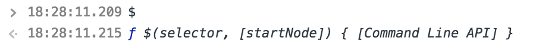
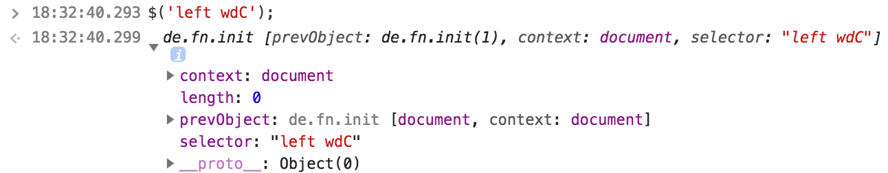
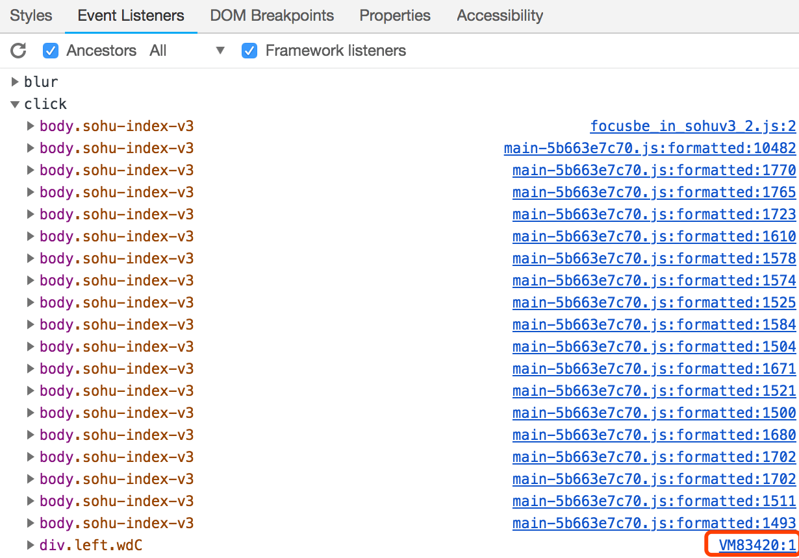
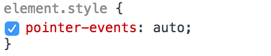
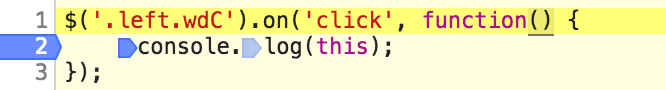

# 记一次控制台addEvent调试
## 缘起
为了研究`Dom Event`中`this`的指向问题。在控制台中给 DOM 绑定事件后，点击 DOM 之后却死活不打印日志，虽然最后结论非常简单，但是追溯问题的过程很有意思！值得记录一下。

## 排查过程
```html
<div class="left wdC">客服邮箱</div>
```

```javascript
$('left wdC').on('click', function() {
	console.log(this);
});
```
#### 1. 确认 *$* 是不是正常
1. 在控制台输入：*$* 输出：`ƒ (e,t){return new de.fn.init(e,t)}`
2. 如果全局的$没有被jQuery或者Zepto等使用，会输出



> 证明 jQuery 被正确加载，且已经在 window 全局注册

#### 2. 确认元素是否被正确选中
1. `$('left wdC')` 展开之后的`length` 为 0，context指向 `document`，证明并没有选择到元素
> 如果使用的是原生的API，`document.querySelector('left wdC');`, 则会返回 `null`



2. 仔细一看，发现把 DOM 上的 class名 直接拷贝过来做成 `selector` 了，显然是错误的。
3. 改成 `$('.left.wdC')`, 发现返回的结果`length` 为 1，key 为 0 的项指向的就是对应的 DOM

#### 3. 确认对应的监听是否已经添加到 `Dom`
右键点击 `检查`，在弹出的调试窗口点击 `Event Listeners`, 点击 `click`, 拉到最下面发现 key 为 `div.left.wdC` 事件，证明监听已经加上



> 或者使用 Chrome 提供的调试 API: `getEventListeners($('.left.wdC')[0])`，也能看到对应的DOM上存在了click 事件侦听

还是没有打印日志，难道把这个元素的事件禁止了？

#### 4. 确认监听事件的`回调函数`能够正常调用
- 找到该元素，手动给`element.style`添加`pointer-events: auto;`



> 还是不行，进一步确认回调函数是否被执行。

#### 5 确认回调函数确实被调用了
在 `Event Listeners` 中点击 `VM` 开头的链接，在对应的资源中打上断点。再次点击，果然停在了断点处，证明点击事件的 **回调函数被正常执行！！！**



#### 6. 确认回调函数中的代码被正确执行
> 回调函数真正执行的只有一行代码，但却没有成功？

- 我们 在控制台输入 `console.log.toString()`, 输出的是一个函数体没有内容的空函数 `"function(){}"`,
- 而有函数体的函数执行 `toString` 会将函数体内的内容输出出来
- 打开 Google 输入 `console.log.toString()`，输出 `"function log() { [native code] }"`

- !!! 证明 `console.log` **被改写了！**
> 可以在断点处查看 `console.log`, 发现其定义在项目中的 `main.js` 中，而不是浏览器的 Native API

### 回调函数不执行其他可能的原因
- 在需要监听的元素上面有另外一个`浮层`，导致事件无法触发
- Chrome 调试移动端页面时，touch圆环在窗口中的位置，和实际点击到页面中的位置存在偏移

## 结论
因为IE8使用console，狐首为了兼容 IE8, 将 `console` 相关方法全部重写成了空函数，导致控制台不输出日志。如果这里原来是 `alert`，很可能就没有这篇文章了，哈哈~

## 思考
在开发的过程中，难免会因为开小差写错一个**变量名**而导致错误；因为对错误想当然而导致与真正的问题*南辕北辙*。当遇到问题的时候，**要相信问题总能被解决**（暂时没解决可能是缺了点耐心，或者忽略了一些细节），遇到问题的时候恰恰是解决问题和提高的时候。小错误的价值不一定在于问题本身，可能在分析问题的完整方法论，以及在解决问题中*发现的自己的短板*和*意想不到的小惊喜！*

## 意外收获
[Chrome Command Line API 参考](https://developers.google.cn/web/tools/chrome-devtools/console/command-line-reference?hl=zh-cn)