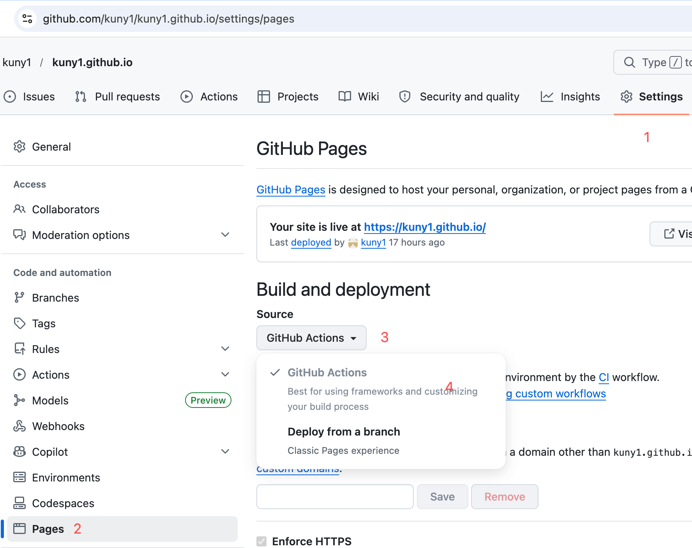
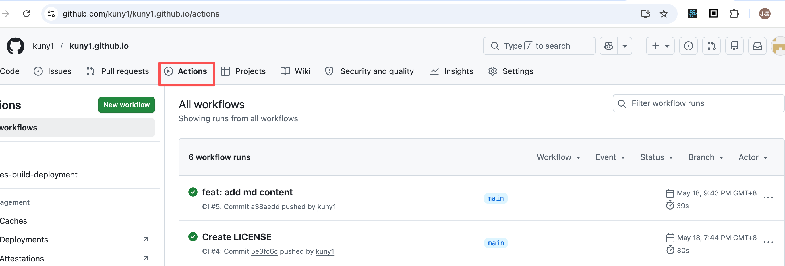

# GitHub-Pages 初始化配置

## 基础准备
> 参考 https://docs.github.com/en/pages/quickstart

## 维护 Github Pages 项目

1. `git clone git@github.com:kuny1/kuny1.github.io.git`
2. 参考 `站点技术选型.md` 选择了 VitePress 作为最终方案
   - 重新熟悉 Vue 框架
   - 无缝使用现代 Vite 等生产力脚手架
   - Vue 官方维护，文档友好

### VitePress 配置
> 参考：https://vitepress.dev/zh/guide/getting-started

1. npm add -D vitepress@next
2. npx vitepress init
3. 修改配置文件：`.vitepress/config.mts`
4. 本地调试：`npm run docs:dev`

### VitePress 发布到 Github Pages 
1. 本地验证（可以看到 .md 文章已经生成了 .html 文件可以直接访问了）
   - npm run docs:build
   - docs:preview
2. GitHub Pages 配置
   - 创建 deploy.yml 的配置文件
   - 参考 Github Pages 官方配置：https://docs.github.com/en/actions/get-started/quickstart
   - 参考 VitePress 示例：https://vitepress.dev/zh/guide/deploy#github-pages
3. 应用 GitHub Actions 的方式管理部署

4. 提交代码（首次提交带 Github Actions 配置的代码不会触发流水线任务）
5. 再次推送代码到指定分支
6. 可以在 Actions 的标签下面看到任务已经在进行中了
7. 稍等一分钟左右，可以看到已经成功

## 总结
- 抛弃老旧的 Jekkly 解决方案，选择现代的 VitePress 作为博客网站的方案
- 对照着文档，按部就班进行配置
- 跑通 MVP 完整流程，后续文章发布&站点更新，自动化